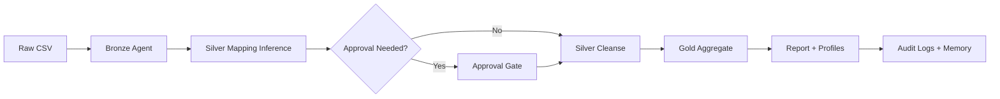

# Architecture

## Overview

This project implements an agentic Medallion Architecture for retail sales:

1. Bronze agent ingests raw CSV files and profiles source data.
2. Silver agent infers source-to-target mappings, requests approval when confidence is low, and applies data cleansing/business rules.
3. Gold agent aggregates Silver output by month and store.
4. Reporting agent publishes run summaries and outputs.
5. Observability tracks events and mapping decisions for auditability.

## Workflow

## Agent memory and approvals

- Mapping signatures are stored in `audit_logs/mapping_memory.json`.
- Historical mappings are reused for known source schemas.
- Confidence threshold and auto-approval policy are environment-driven.

## Reliability and controls

- Cleansing enforces required keys, quantity and discount business rules.
- All stages emit events to `audit_logs/pipeline_events.jsonl`.
- Unit tests cover inference, gating, and orchestration.
